# Panel Los Esperados

Panel de gestion d'une famille DarkRP sur Garry's Mod. L'application couvre l'ensemble
du cycle de vie d'un membre — recrutement, suivi d'activité, sanctions, absences,
white-list, dettes bancaires — et se synchronise en continu avec le serveur de jeu
(API LYG) et avec le serveur Discord de la famille.

Le dépôt contient deux processus applicatifs distincts : un panel web Next.js et un
worker Discord. Ils partagent la même base PostgreSQL et communiquent par une table
d'`Outbox` plutôt que par appels directs.

> **Portée de ce document.** Il décrit l'état réel du dépôt et de la production à la
> date de rédaction (15/08/2026). Les valeurs numériques ont été relevées sur le code
> et sur la base de production. Les points incertains sont explicitement signalés
> comme tels.

---

## Sommaire

1. [Vue d'ensemble](#1-vue-densemble)
2. [Architecture générale](#2-architecture-générale)
3. [Stack technique](#3-stack-technique)
4. [Structure du dépôt](#4-structure-du-dépôt)
5. [Modèle de données](#5-modèle-de-données)
6. [Panel web](#6-panel-web)
7. [Worker Discord](#7-worker-discord)
8. [Outbox Discord](#8-outbox-discord)
9. [Tâches planifiées](#9-tâches-planifiées)
10. [Intégration LYG](#10-intégration-lyg)
11. [Recrutement](#11-recrutement)
12. [Sanctions et discipline](#12-sanctions-et-discipline)
13. [White-list](#13-white-list)
14. [Activité et réunions](#14-activité-et-réunions)
15. [Dettes bancaires](#15-dettes-bancaires)
16. [Sécurité et contrôle d'accès](#16-sécurité-et-contrôle-daccès)
17. [Configuration](#17-configuration)
18. [Déploiement et production](#18-déploiement-et-production)
19. [Exploitation, tests et limites connues](#19-exploitation-tests-et-limites-connues)

---

## 1. Vue d'ensemble

### Ce que fait le projet

| Domaine | Résumé |
| --- | --- |
| **Recrutement** | Candidatures depuis Discord, questionnaire noté, décision tracée, archivage des messages du ticket |
| **Membres** | Fiche par membre, grades, rangs Discord, historique, liaison Steam ↔ Discord ↔ compte LYG |
| **Activité** | Relevé de temps de jeu hebdomadaire, réunions, détection d'inactivité, alertes graduées |
| **Sanctions** | Application, notification, expiration automatique, justification par le membre |
| **Absences** | Déclaration, validation, expiration, effets de bord sur les autres modules |
| **White-list** | Classe WL réelle lue sur LYG, classe planifiée côté panel, réconciliation |
| **Dettes** | Détection de dettes bancaires, rappels espacés et escaladés |
| **Discord** | Toutes les écritures Discord passent par une file `Outbox` traitée par le worker |

### Chiffres du dépôt

Relevés sur le dépôt et la base au 15/08/2026 :

| Élément | Valeur |
| --- | --- |
| Routes API (`app/api/**/route.ts`) | 237 |
| Modèles Prisma | 60 |
| Enums Prisma | 25 |
| Types de job Outbox (`DiscordJobType`) | 26, dont 11 avec handler |
| Statuts de job (`DiscordJobStatus`) | 7 déclarés, 4 réellement produits |
| Helpers de garde d'accès | 18 |
| Tâches planifiées dans le worker | 12 |
| Timers systemd | 4 |
| Services systemd applicatifs | 3 |
| Tests | 288, répartis sur 19 fichiers |

---

## 2. Architecture générale

Le principe structurant : **le panel n'écrit jamais directement sur Discord.** Il
dépose un job dans la table `DiscordOutbox` ; le worker le consomme. Ce découplage
rend les écritures Discord rejouables, idempotentes et observables.

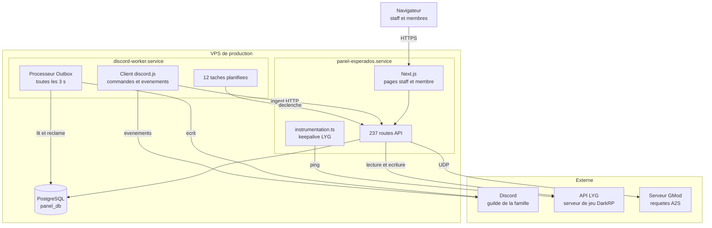

### Une seule sortie vers Discord

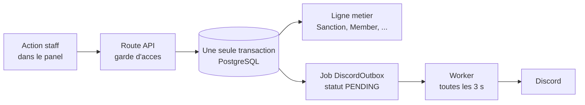

La ligne métier et le job Outbox sont écrits **dans la même transaction**. Si la
transaction échoue, aucun des deux n'existe : on ne peut pas se retrouver avec une
sanction enregistrée sans notification, ni l'inverse.

---

## 3. Stack technique

Versions **installées** en production (relevées dans `node_modules`) :

| Composant | Version | Déclaration `package.json` |
| --- | --- | --- |
| Node.js | 24.13.1 | — |
| Next.js | 16.1.3 | `16.1.3` |
| React | 19.2.3 | `19.2.3` |
| TypeScript | 5.x | `^5` |
| Prisma (client + CLI) | 5.22.0 | `^5.22.0` |
| discord.js | 14.25.1 | `^14.16.3` |
| NextAuth | 4.x | `^4.24.13` |
| Vitest | 4.1.5 | `^4.1.5` |
| PostgreSQL | 17.7 | — |

Notes :

- Le worker résout **la même version de discord.js** que le panel (14.25.1).
- Prisma est volontairement resté en **branche 5**. Aucune montée vers Prisma 6/7
  n'a été faite.
- L'alias de chemin `@/*` pointe vers `src/*`.
- PostgreSQL écoute en local, sur un port non standard.

---

## 4. Structure du dépôt

```
panel/
├── app/                    Next.js App Router
│   ├── api/                237 routes API
│   │   ├── admin/          opérations d'administration
│   │   ├── cron/           déclencheurs appelés par le worker ou systemd
│   │   ├── debug/          diagnostics, protégés
│   │   ├── discord/        entrées appelées par le bot
│   │   ├── ingest/         ingestion Discord → panel
│   │   ├── lyg/            proxy et lectures LYG
│   │   ├── me/             espace membre
│   │   └── staff/          espace staff
│   ├── (member)/           pages de l'espace membre
│   ├── staff/              pages de l'espace staff
│   └── login/              authentification
├── src/
│   ├── lib/
│   │   ├── activity/       moteur d'activité (évaluation, plan, application)
│   │   ├── auth/           résolution du membre courant
│   │   ├── discord/        construction des jobs Outbox
│   │   ├── lyg/            synchronisations LYG
│   │   ├── guards.ts       gardes d'accès
│   │   └── rbac.ts         permissions
│   └── components/
├── discord-worker/
│   └── src/
│       ├── outbox-processor.ts   consommation de la file
│       ├── outbox-retry.ts       politique de reprise
│       ├── features/             commandes et automatismes du bot
│       └── *-auto.ts             tâches planifiées
├── prisma/
│   ├── schema.prisma       60 modèles, 25 enums
│   └── migrations/         23 dossiers sur disque
├── tests/                  19 fichiers, 288 tests
├── scripts/                scripts d'exploitation ponctuels
├── deploy/systemd/         unités du scraper de familles uniquement
├── pages/api/auth/         point d'entrée NextAuth
└── instrumentation.ts      démarrage du keepalive LYG en production
```

> **Attention à `instrumentation.ts`.** Ce fichier est à la **racine** du dépôt, hors
> de `app/`, `src/` et `discord-worker/`. Il démarre le keepalive LYG quand
> `NODE_ENV === "production"`. Une recherche limitée aux trois dossiers principaux le
> manque et conclut à tort que le keepalive n'a pas d'appelant.

---

## 5. Modèle de données

60 modèles Prisma. Les principaux et leurs relations :

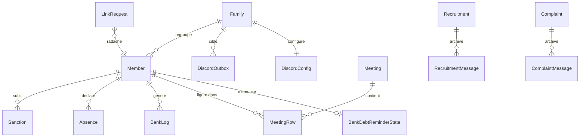

### Convention critique : CUID, jamais slug

`Family` possède **deux identifiants** :

| Champ | Exemple de forme | Usage |
| --- | --- | --- |
| `Family.id` | CUID, `cm...` | **Toutes les clés étrangères et tous les `where`** |
| `Family.slug` | `esperados` | Affichage et URL uniquement |

Le helper `toFamilyCuid()` normalise l'un vers l'autre. Un `where: { familyId: "esperados" }`
compile parfaitement et ne renvoie **jamais rien** — c'est un bug silencieux qui a été
corrigé à plusieurs reprises dans ce dépôt. Utiliser systématiquement `resolveFamilyId()`
ou `toFamilyCuid()` avant toute requête.

### État de Prisma

| Élément | État |
| --- | --- |
| `_prisma_migrations` | 77 lignes, dont 75 terminées et 2 marquées `rolled_back` conservées volontairement |
| Dossiers de migration sur disque | 23 |
| Migrations présentes en base uniquement | 52, conservées délibérément |
| `migration_lock.toml` | `postgresql` |
| `prisma migrate status` | « Database schema is up to date! », sortie 0 |
| `prisma migrate diff` | « No difference detected » |

Les deux lignes `rolled_back` correspondent à des tentatives historiques dont une
reprise ultérieure a réussi. Elles sont **conservées à dessein** : les supprimer
réécrirait l'historique sans bénéfice.

---

## 6. Panel web

### Découpage

| Espace | Public | Garde typique |
| --- | --- | --- |
| `/login` | Tout le monde | — |
| `/(member)` | Membre lié à un compte | `requireLinkedMember`, `requireActiveMember` |
| `/staff` | Staff de la famille | `requireStaff`, `requireStaffFull`, `requirePermission` |
| `/api/ingest/**` | Worker uniquement | secret partagé |
| `/api/cron/**` | Planificateur | secret partagé |

### Familles de routes API

| Préfixe | Rôle |
| --- | --- |
| `/api/staff/**` | Toutes les actions de gestion : membres, sanctions, réunions, absences, plaintes, WL, configuration Discord |
| `/api/admin/**` | 17 routes d'administration : reprises, réparations, relances manuelles |
| `/api/me/**` | Espace membre : ses absences, ses sanctions, ses justifications |
| `/api/discord/**` | Points d'entrée appelés par le bot pour les interactions et formulaires Discord |
| `/api/ingest/**` | Ingestion depuis le worker : tickets, archives de messages, heartbeat, métriques, push |
| `/api/cron/**` | Déclencheurs planifiés, dont le watchdog du worker |
| `/api/lyg/**` | Lectures et actions sur l'API du serveur de jeu |
| `/api/debug/**` | Diagnostics, protégés par garde |
| `/api/health` | Sonde de santé |

`/api/health` renvoie notamment `ok`, `db`, `worker.alive` et `version`.

### Routes d'ingestion

Le bot Discord n'écrit pas directement en base : il appelle le panel.

```
ingest/heartbeat                          battement du worker
ingest/metrics                            métriques d'exécution
ingest/push                               notifications push
ingest/tickets, ingest/tickets/open       tickets d'assistance
ingest/recruitment/messages-archive       archivage au fil de l'eau
ingest/complaint/messages-archive         archivage au fil de l'eau
ingest/members/by-discord/[discordId]     lecture d'un membre
ingest/rename-member                      renommage
ingest/link-requests/[id]/accept          traitement d'une demande de liaison
ingest/link-requests/[id]/refuse
ingest/link-requests/[id]/archive
```

---

## 7. Worker Discord

Processus Node séparé (`discord-worker.service`), avec **son propre fichier
d'environnement**. C'est un piège récurrent : un secret ajouté au `.env` du panel et
oublié côté worker rend une fonctionnalité muette sans aucune erreur.

Le worker assure quatre rôles :

1. **Client Discord** — commandes, interactions, modération, réponses automatiques
2. **Processeur Outbox** — consomme la file toutes les 3 s
3. **Planificateur** — 12 tâches périodiques qui appellent des routes du panel
4. **Sonde** — envoie un battement au panel, exploité par `/api/health`

### Verrou mono-instance

Le worker s'appuie sur la table `WorkerHeartbeat` avec un TTL de 150 s. Une seconde
instance qui démarre voit le verrou tenu et refuse de tourner.

Le verrou est **libéré à l'arrêt propre**. En cas de crash brutal, une boucle de
redémarrage `lock_denied` peut apparaître : il faut alors vider la table puis
redémarrer le service.

---

## 8. Outbox Discord

### Table et cycle de vie

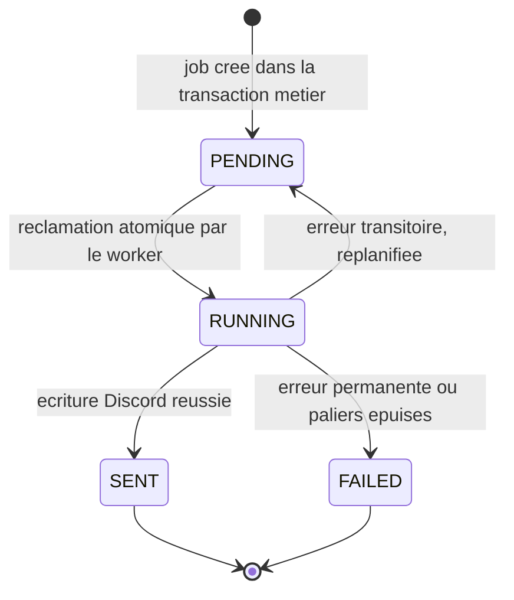

`DiscordJobStatus` déclare **7 valeurs** : `PENDING`, `SENDING`, `SENT`, `FAILED`,
`CANCELED`, `RUNNING`, `SUCCEEDED`.

En pratique, seuls `PENDING`, `RUNNING`, `SENT` et `FAILED` sont produits. Sur les
1669 jobs présents en base au moment de la rédaction : 1665 `SENT`, 4 `FAILED`.
`SENDING`, `CANCELED` et `SUCCEEDED` sont des vestiges d'itérations antérieures et
ne sont écrits par aucun chemin de code actuel.

### Flux complet d'un job

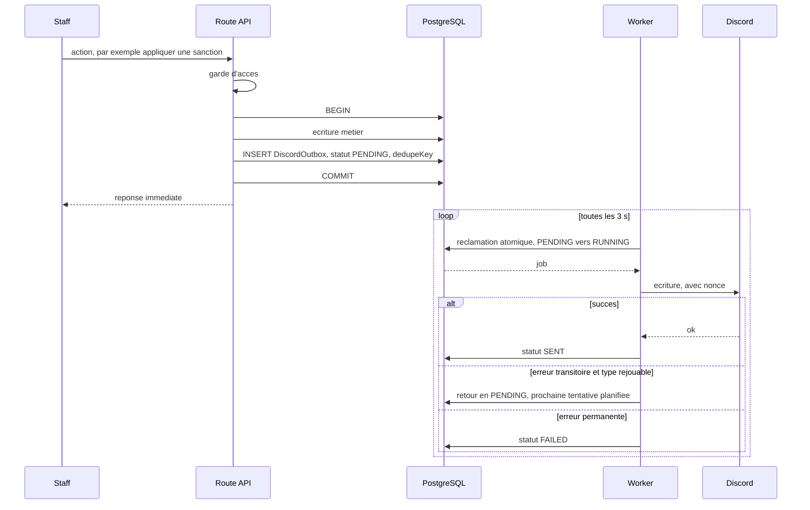

### Idempotence, à deux niveaux

| Niveau | Mécanisme | Ce qu'il empêche |
| --- | --- | --- |
| Base | `dedupeKey` unique sur `DiscordOutbox` | Deux jobs pour le même effet métier |
| Discord | `nonce` + `enforceNonce` côté serveur Discord | Deux messages identiques si le worker rejoue |

Le `nonce` Discord est **limité à 25 caractères** — vérifié empiriquement. Une clé plus
longue est rejetée par l'API.

> **Piège PostgreSQL.** Dans une transaction, une violation de contrainte **abandonne
> toute la transaction** (`25P02`). Attraper le `P2002` côté TypeScript ne la ressuscite
> pas : toute commande suivante échoue. Le motif « avaler le P2002 et continuer », valable
> hors transaction, casse ici. Les insertions de jobs faites à l'intérieur d'une
> transaction utilisent donc `createMany({ skipDuplicates: true })`, qui se traduit par
> `ON CONFLICT DO NOTHING` et laisse PostgreSQL absorber le conflit sans erreur.

### Les 26 types de job

**11 types disposent d'un handler** et sont donc réellement exécutables :

```
ASSIGN_ROLE              BANK_DEBT_PING_BATCH     BANK_DEBT_PING_SINGLE
COMPLAINT_DECISION       DELETE_MESSAGE           MEMBER_DM
RECRUITMENT_DECISION     REMOVE_ROLE              SANCTION_APPLY
SANCTION_NOTIFY          SEND_MESSAGE
```

**15 types n'ont pas de handler.** Ils restent déclarés dans l'enum Prisma :

```
ABSENCE_JUSTIFICATION_CREATED   ACTIVITY_ACTION_NOTIFY    ACTIVITY_ALERT_INACTIVE
ACTIVITY_ALERT_LOW              ACTIVITY_ALERT_RECOMMEND_KICK   ACTIVITY_DIGEST
APPLY_ROLES                     MEETING_NOTIFY_RECAP      MEETING_NOTIFY_UPSERT
ME_ABSENCE_CREATED              ME_ABSENCE_JUSTIFIED      ME_SANCTION_JUSTIFIED
REMOVE_ROLES                    SANCTION_JUSTIFICATION_CREATED   SYNC_MEMBER
```

Ces types ont été **conservés délibérément** : supprimer une valeur d'enum PostgreSQL
est une opération lourde, et certains restent des points d'extension prévus. Ils ne
sont produits par aucun chemin de code actuel — à l'exception notable décrite plus bas
pour l'activité, qui émet des `SEND_MESSAGE` plutôt que les types `ACTIVITY_ALERT_*`.

`BANK_DEBT_PING_BATCH` est un cas particulier : son producteur a été retiré lors d'une
refonte des rappels de dette, mais **son handler est conservé**.

### Politique de reprise

`discord-worker/src/outbox-retry.ts`.

**11 types rejouables** : `SANCTION_APPLY`, `ASSIGN_ROLE`, `REMOVE_ROLE`,
`DELETE_MESSAGE`, `SEND_MESSAGE`, `MEMBER_DM`, `SANCTION_NOTIFY`, `COMPLAINT_DECISION`,
`BANK_DEBT_PING_SINGLE`, `BANK_DEBT_PING_BATCH`, `RECRUITMENT_DECISION`.

**Paliers de report** : 5 s → 15 s → 45 s → 2 min → 5 min → 15 min → 30 min → 1 h,
avec une gigue de ±20 % pour éviter que plusieurs jobs ne repartent en même temps.

**Erreur inconnue → permanente.** Le choix par défaut est de ne pas rejouer ce qu'on
ne sait pas classer, plutôt que de marteler l'API Discord.

---

## 9. Tâches planifiées

### Dans le worker — 12 tâches

Intervalles relevés dans les logs de production (`*_scheduled`, champ `intervalMs`).
La casse des noms est celle des journaux : certaines tâches s'y annoncent en minuscules,
d'autres en majuscules. Cette hétérogénéité est d'origine, pas une coquille de ce
document.

| Tâche | Intervalle | Garde de fraîcheur | Rôle |
| --- | --- | --- | --- |
| `outbox` | 3 s | — | Consomme la file Discord |
| `banklogs_auto_sync` | 60 s | 60 s | Journaux bancaires LYG |
| `hierarchy` | 60 s | — | Hiérarchie des rôles |
| `members_auto_sync` | 90 s | 60 s | Membres depuis LYG |
| `playtime_auto_sync` | 180 s | 150 s | Temps de jeu |
| `DEPARTED_SWEEP` | ~10 min | — | Désactivation des membres partis |
| `absences_expire` | 15 min | — | Fin des absences échues |
| `DEBT_REMINDERS` | 15 min | — | Cycle de rappels de dette |
| `EXPIRE_SANCTIONS` | 15 min | — | Clôture des sanctions échues |
| `GRADE_RECONCILE` | 15 min | — | Cohérence grade panel ↔ rôle Discord |
| `WL_RECONCILE` | 15 min | — | Réconciliation white-list |
| `infos_auto_sync` | 1 h | 1 h | Informations de famille |

La **garde de fraîcheur** est un second verrou, indépendant de l'intervalle : si la
donnée a été rafraîchie il y a moins de N secondes, le cycle est ignoré. Le log
distingue alors explicitement `SYNC` de `SKIP` — cette distinction a été ajoutée parce
qu'un log `ok` indifférencié masquait des cycles qui ne faisaient rien.

Conséquences observées :

- `playtime` : intervalle 180 s contre garde 150 s → **aucun** saut. La garde était
  auparavant à 1 h, ce qui gaspillait 19 appels sur 20.
- `banklogs` : intervalle 60 s contre garde 60 s → **~36 % de sauts**. Situation
  connue, laissée en l'état par décision explicite.

### Timers systemd — 4

| Timer | Déclenchement | Rôle |
| --- | --- | --- |
| `panel-worker-watchdog.timer` | 2 min après le boot, puis toutes les 5 min | Surveille la vivacité du worker |
| `panel-family-scraper.timer` | 3 min après le boot, puis toutes les 10 min | Classement des familles |
| `panel-backup-postgres.timer` | Tous les jours à 03:00 UTC | Sauvegarde de la base |
| `panel-backup-env.timer` | Tous les jours à 03:15 UTC | Sauvegarde des fichiers d'environnement |

---

## 10. Intégration LYG

L'API LYG est la source de vérité du serveur de jeu : membres, temps de jeu, banque,
white-list.

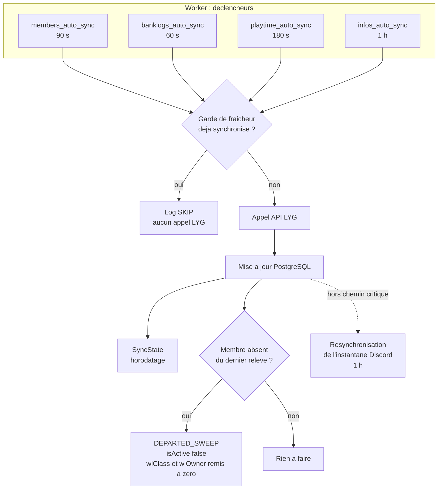

### Points de vigilance

**Quota.** L'API LYG accepte 300 requêtes par tranche de 15 minutes. La boucle
`in-family-loop`, qui interroge les temps de jeu toutes les 5 s, représente à elle
seule environ 720 appels par heure, soit **73 à 83 % de tout le trafic LYG observé**.
Toute nouvelle intégration doit être dimensionnée en tenant compte de cette
consommation de fond.

**Découplage de la resynchronisation Discord.** La resynchronisation de l'instantané
Discord tourne au plus une fois par heure et n'est **pas attendue** par le cycle de
synchronisation des membres. Elle l'était auparavant, ce qui transformait un cycle
réussi mais lent en `exception` — 14 fois par 24 h. Un verrou anti-concurrence
subsiste, et l'échec de la resynchronisation est capté sur place sans remonter.

**Garde-fou des départs.** `DEPARTED_SWEEP` n'agit que sur les membres absents d'un
relevé, avec une marge de 30 minutes calculée sur le `lastSeenAt` maximum. Sans cette
marge, un relevé LYG partiel désactiverait en masse des membres présents.

**Le temps de jeu est hebdomadaire.** `playtime7d` **repart à zéro chaque lundi à
00:00 (Bruxelles)**. Un « le temps a diminué » constaté un lundi est le comportement
normal, pas un bug.

---

## 11. Recrutement

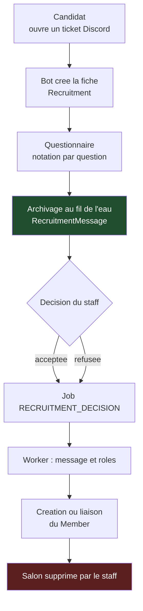

### Trois contraintes non évidentes

**L'archivage se fait au fil de l'eau, jamais à la décision.** Le staff supprime le
salon Discord dès la décision prise. Tenter d'archiver les messages au moment de la
décision renvoie 404 sur tous les fils. C'est pourquoi `RecruitmentMessage` est
alimenté en continu pendant la vie du ticket. 231 messages y sont archivés.

**Priorité du `steamId`.** `Recruitment.steamId` prime sur `Member.steamId` lors du
rapprochement. Le premier vient de la candidature, le second peut être hérité d'un
enregistrement plus ancien ou périmé.

**Points de test indexés sur les identifiants de question.** La notation du
questionnaire est liée aux IDs des questions, pas à leur position. Réordonner les
questions est sans effet ; en supprimer une casse le calcul historique.

---

## 12. Sanctions et discipline

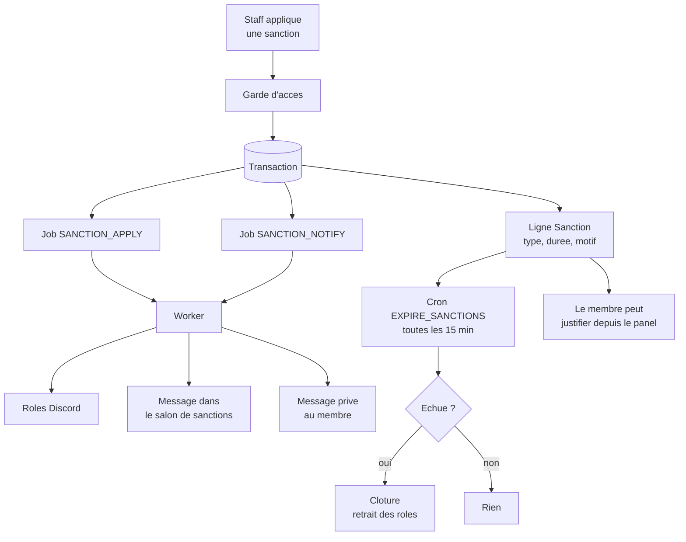

### État en production

| Indicateur | Valeur |
| --- | --- |
| Sanctions enregistrées | 278 |
| Sanctions actives | 110 |
| Sanctions échues non clôturées | 0 |

Le cron `EXPIRE_SANCTIONS` a longtemps été **absent du planificateur**, avec en outre
un décalage de slug et un secret non concordant. Les trois défauts ont été corrigés ;
le compteur de sanctions échues non clôturées à 0 est la vérification de bout en bout.

### Rétrogradation : deux outils distincts

| Outil | Nature | Emplacement |
| --- | --- | --- |
| **Démote** | Sanction disciplinaire, tracée comme telle | Module sanctions |
| **Rétrograder** | Ajustement de rang, sans dossier disciplinaire | `/staff/sanctions` |

Les rangs sont des **rôles Discord ordonnés** (voir `grade-colors.ts`). Promotion comme
rétrogradation se traduisent par un échange de rôles via l'Outbox.

---

## 13. White-list

Le module WL distingue **ce qui est** de **ce qui est prévu**. C'est la distinction la
plus importante du module : la confondre conduit à afficher comme acquis un changement
qui n'a pas encore eu lieu côté jeu.

| Champ | Signification |
| --- | --- |
| `wlClass` | Classe WL **réelle**, lue sur LYG. 1 à 5. Fait autorité |
| `wlOwner` | Drapeau propriétaire **réel**, côté jeu |
| `wlClassIntent` | Classe WL **planifiée** côté panel. `null` = retrait demandé |
| `wlOwnerIntent` | Drapeau propriétaire planifié |
| `wlIntentUpdatedAt` | Dernière modification de l'intention |
| `wlIntentBy` | `discordId` du staff auteur de la modification |

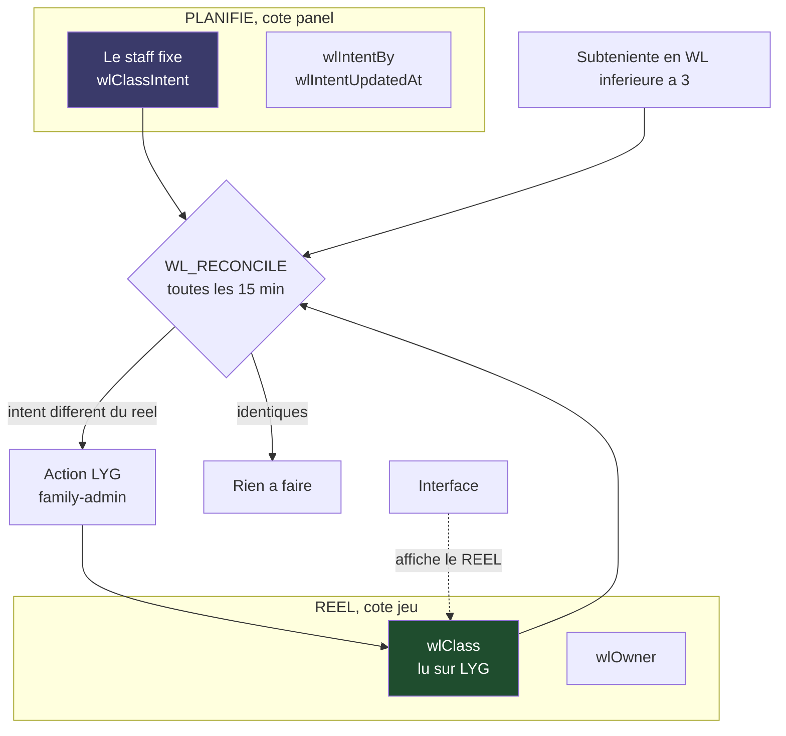

### Règles en vigueur

- **L'interface affiche la classe réelle, jamais l'intention.** Conditionner
  l'affichage sur l'intention laissait croire à un changement qui n'avait pas eu lieu
  côté jeu.
- **Auto-WL3 Subteniente.** Le réconciliateur monte en WL3 tout Subteniente trouvé en
  WL inférieure à 3. L'action `lygFamilyRankUp` de type `up` **améliore** la classe et
  ne la dégrade jamais.
- **Le départ efface la WL.** `DEPARTED_SWEEP` remet `wlClass` à `null` et `wlOwner`
  à `false` en même temps qu'il pose `isActive: false`. Sans cela, un membre parti
  conservait indéfiniment sa classe.

**41 membres** portent une classe WL en production.

> **Incertitude assumée.** La règle exacte permettant de conclure au succès d'une
> action WL côté LYG n'est pas encore arrêtée. Elle doit être établie à partir des
> journaux `lyg_family_action_observed` accumulés. Tant que ce point n'est pas tranché,
> la réconciliation retente une action déjà appliquée ; l'action étant idempotente à la
> hausse, cela reste sans effet de bord observable.

---

## 14. Activité et réunions

Le module d'activité évalue la participation des membres **à la finalisation d'une
réunion**, et jamais en cours de semaine.

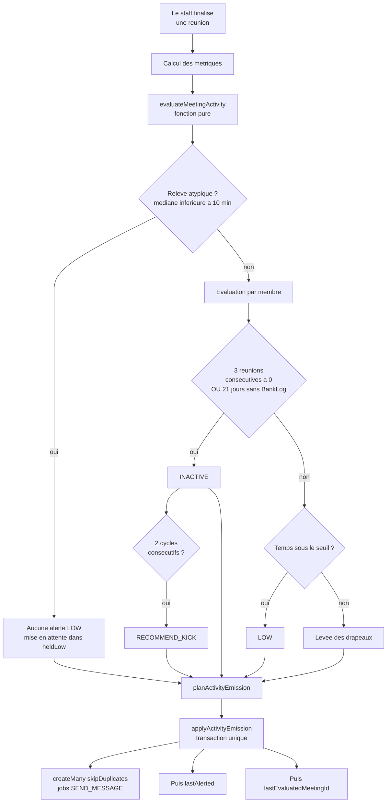

### Constantes en vigueur

Toutes dans `src/lib/activity/evaluate-meeting.ts` :

| Constante | Valeur | Signification |
| --- | --- | --- |
| `DEFAULT_FAMILY_PLAYTIME_THRESHOLD` | 300 min | Seuil de repli si le membre n'a pas de seuil propre |
| `INACTIVE_ZERO_MEETINGS` | 3 | Réunions consécutives à 0 avant `INACTIVE` |
| `INACTIVE_BANK_SILENCE_DAYS` | 21 | Jours sans `BankLog` avant `INACTIVE` |
| `RECOMMEND_KICK_CYCLES` | 2 | Cycles d'inactivité avant recommandation d'exclusion |
| `ATYPICAL_MEDIAN_MINUTES` | 10 | Sous ce seuil, le relevé est jugé atypique |
| `BASELINE_MEETINGS` | 4 | Profondeur du calcul de médiane de référence |

Le seuil individuel `Member.playtimeRequiredMinutes` est **prioritaire** sur les
300 minutes par défaut. Il se modifie depuis la fiche membre.

### Trois garanties structurelles

**Une absence de ligne n'est pas un zéro.** Un membre qui ne figure pas dans les lignes
d'une réunion ne compte pas comme ayant fait 0 minute : le comptage des zéros
consécutifs s'interrompt sur une ligne manquante. Ce choix évite de sanctionner une
lacune de saisie.

**L'ordre d'écriture est strict et transactionnel.**

```
job cree ou deja present  →  ALORS lastAlerted = true  →  ALORS lastEvaluatedMeetingId
```

Les trois écritures partagent la même transaction. L'ordre inverse — poser le drapeau
puis émettre — perdrait définitivement une alerte à la moindre panne entre les deux :
l'évaluation suivante la croirait déjà annoncée. C'est PostgreSQL qui tient
l'invariant, pas une convention de code.

**Le module recommande, il n'agit pas.** `RECOMMEND_KICK` produit un message. Aucun
champ du plan d'émission ne permet d'exprimer une exclusion, un retrait de rôle ou une
action LYG — un test verrouille cette propriété.

### Signaler et retenir

La stratégie retenue est **signaler et retenir**, et non la suppression pure. Quand un relevé
est jugé atypique, les alertes `LOW` ne sont pas jetées : elles sont conservées dans
`heldLow` avec le contexte du relevé. Une seconde barrière, dans le planificateur,
retient tout `LOW` sur un relevé atypique même si le moteur en laissait passer un.

### État actuel : dormant

> **Le module est complet, testé, branché — et n'émet rien aujourd'hui.**
> `DiscordConfig.activityLogChannelId` n'est pas renseigné. Dans ce cas, l'orchestrateur
> renvoie `ACTIVITY_CHANNEL_NOT_CONFIGURED` et n'écrit aucun job. Renseigner ce salon
> active les alertes. La première évaluation devrait alors produire **4 alertes
> `INACTIVE`** et retenir **27 alertes `LOW`** — chiffres issus d'une évaluation à blanc,
> à reconfirmer au moment de l'activation.

Note d'implémentation : l'émission passe par des jobs `SEND_MESSAGE` porteurs
d'embeds, et non par les types `ACTIVITY_ALERT_*` de l'enum, qui restent sans handler.

---

## 15. Dettes bancaires

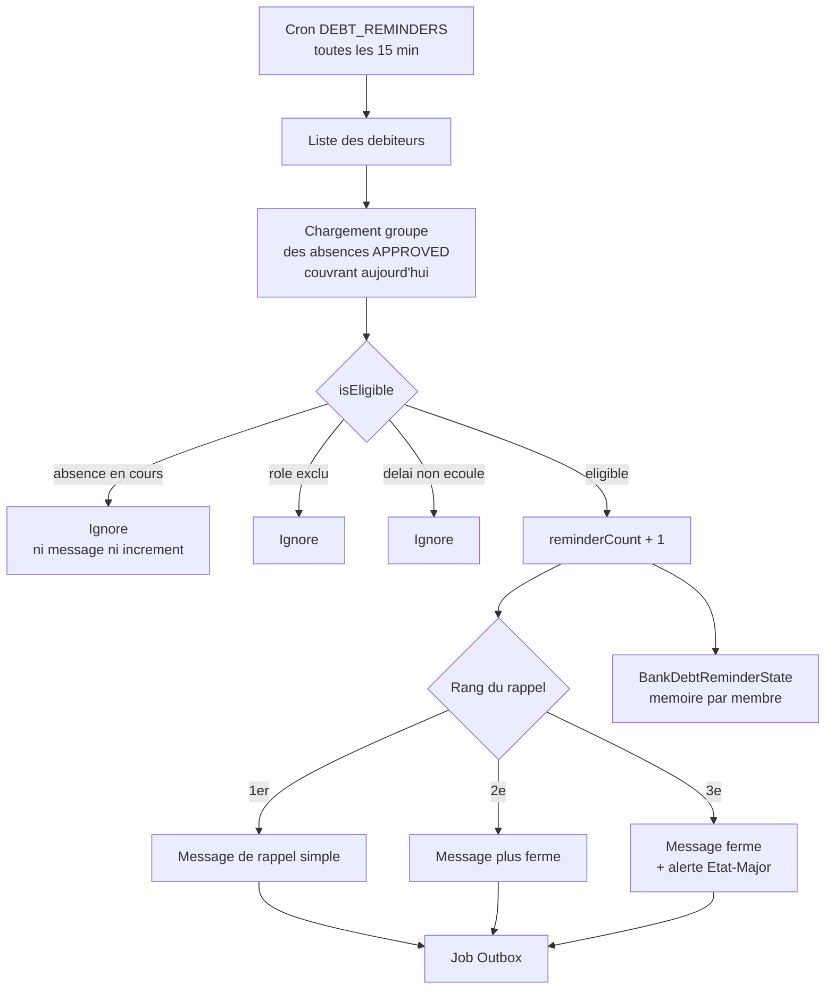

### Paramétrage réel

Lu dans `DiscordConfig` en production :

| Paramètre | Valeur |
| --- | --- |
| `bankDebtAutoEnabled` | `true` |
| `bankDebtPingCooldownDays` | 5 |
| `bankDebtEscalateAfter` | 3 |

Le délai est exprimé **en jours**, pas en heures. La mémoire est par membre, dans
`BankDebtReminderState`. **2 débiteurs actifs** au moment de la rédaction.

### Deux garde-fous

**Aucun rappel pendant une absence validée.** L'exclusion se fait dans `isEligible`,
c'est-à-dire **avant** l'incrément du compteur. Placer le contrôle plus loin
suspendrait l'envoi mais laisserait le compteur grimper, et le membre reviendrait
d'absence avec une escalade non méritée. Les absences sont chargées en **une seule
requête groupée** — le cron tourne une centaine de fois par jour.

**L'escalade s'arrête au signalement.** Au 3e rappel, le message alerte l'État-Major et
indique explicitement que le cran suivant relève d'une décision humaine. Le système ne
prononce pas de démote.

---

## 16. Sécurité et contrôle d'accès

### Authentification

NextAuth 4 avec Discord comme fournisseur OAuth.

| Paramètre | Valeur |
| --- | --- |
| Stratégie de session | `database` |
| Portées OAuth | `identify email guilds guilds.members.read` |
| Page de connexion | `/login` |
| Point d'entrée | `pages/api/auth/[...nextauth].ts`, options dans `auth.ts` |

### Les 18 gardes

Déclarés dans `src/lib/guards.ts` et `src/lib/rbac.ts` :

```
requireActiveMember      requireAdmin              requireAnyPermission
requireAuth              requireChef               requireChefFamille
requireEncadrantOrAbove  requireFullWriter         requireLinkAccess
requireLinkedMember      requireLosEsperados       requirePermission
requirePrivileged        requireRecruiterOrAbove   requireRole
requireStaff             requireStaffAccess        requireStaffFull
```

Un audit de couverture a confirmé **0 route `/api/staff/**` sans garde**. Un audit
antérieur en annonçait 47 : le motif de recherche employé ignorait `requirePrivileged`,
`requirePermission` et `requireChefFamille`. Toute vérification de couverture doit
énumérer les 18 helpers.

Les routes appelées par des automates ne portent pas de garde de session mais un
**secret partagé** en en-tête, par exemple `x-cron-secret` pour
`staff/absences/expire-discord`.

### Séparation d'autorité

Deux autorités distinctes coexistent et ne doivent pas être confondues :

- Le **chef de famille**, propriétaire côté jeu, autorité sur la famille dans le panel.
- Le **fondateur du serveur**, autorité sur l'infrastructure GMod, **qui n'est pas
  rattaché comme membre de la famille** dans le modèle de données.

---

## 17. Configuration

### Fichiers d'environnement

| Processus | Fichier | Remarque |
| --- | --- | --- |
| Panel | `.env.prod` | 45 variables |
| Worker | fichier d'environnement **distinct** | À maintenir en parallèle |

> **Piège récurrent.** Le worker ne lit pas le `.env` du panel. Un secret ajouté d'un
> seul côté rend une fonctionnalité silencieusement inopérante — sans erreur, sans log.
> Vérifier systématiquement les deux fichiers.

### Variables, par famille

Aucune valeur n'est reproduite ici. Seuls les **noms** sont listés.

**Base et exécution**
`DATABASE_URL`, `NODE_ENV`, `PANEL_BASE_URL`, `PANEL_INTERNAL_BASE_URL`

**Authentification**
`AUTH_SECRET`, `AUTH_TRUST_HOST`, `NEXTAUTH_SECRET`, `NEXTAUTH_URL`, `DEBUG_AUTH`

**Discord — application**
`DISCORD_BOT_TOKEN`, `DISCORD_TOKEN`, `DISCORD_CLIENT_ID`, `DISCORD_CLIENT_SECRET`,
`DISCORD_GUILD_ID`, `GUILD_ID`, `DISCORD_WORKER_SECRET`

**Discord — rôles**
`STAFF_ROLE_ID`, `DISCORD_STAFF_FULL_ROLE_IDS`, `CHEF_FAMILLE_ROLE_ID`,
`SOUS_CHEF_FAMILLE_ROLE_ID`, `ETAT_MAJOR_ROLE_ID`, `RECRUTEUR_ROLE_ID`,
`DISCORD_RECRUITER_ROLE_IDS`

**Discord — salons**
`DISCORD_LOGS_CHANNEL_ID`, `SANCTION_LOG_CHANNEL_ID`, `WHITELIST_CHANNEL_ID`,
`CONTACT_CHANNEL_ID`, `BOTS_FAMILLE_CHANNEL_ID`, `TICKETS_PARENT_CHANNEL_ID`,
`TICKETS_LOGS_CHANNEL_ID`

**Personnes**
`OWNER_DISCORD_ID`, `ADMIN_DISCORD_IDS`, `STAFF_DISCORD_IDS`

**LYG**
`LYG_BASE_URL`, `LYG_TOKEN`, `LYG_FAMILY_TOKEN`, `LYG_COOKIE_ENCRYPTION_KEY`,
`LYG_BANKLOGS_MAX_PAGES`

**Ingestion et automates**
`INGEST_BASE_URL`, `INGEST_SECRET`, `CRON_SECRET`, `DISCORD_ALERT_WEBHOOK_URL`

**Notifications push**
`VAPID_PRIVATE_KEY`, `VAPID_SUBJECT`, `NEXT_PUBLIC_VAPID_PUBLIC_KEY`

Certains réglages ne vivent **pas** dans l'environnement mais dans la table
`DiscordConfig` : salons d'activité, paramètres de dette, gabarits de messages. Ils se
modifient depuis l'interface staff.

---

## 18. Déploiement et production

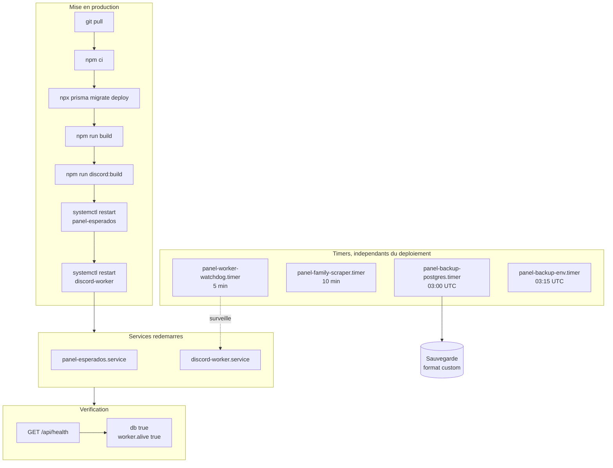

### Services

| Unité | État | Démarrage auto | Rôle |
| --- | --- | --- | --- |
| `panel-esperados.service` | actif | activé | Panel de production. Redémarré à chaque mise en production |
| `discord-worker.service` | actif | activé | Worker Discord. Redémarré à chaque mise en production |
| `panel-esperados-dev.service` | actif | activé | Instance de développement. **Hors de la séquence de mise en production** |

Les unités systemd ne sont pas toutes versionnées : `deploy/systemd/` ne contient que
celles du scraper de familles. Les autres vivent directement dans
`/etc/systemd/system/`.

D'autres unités existent sur la machine pour le serveur de jeu et pour un panel de jeu
distinct. Elles ne font pas partie de ce dépôt.

> **Le serveur GMod tourne nativement sur le même VPS**, sans conteneur. Trois pièges
> connus : la sortie standard est tamponnée, le premier démarrage à cache froid est
> lent, et les requêtes A2S ne répondent pas en bouclage local — il faut tester depuis
> l'adresse publique. Un serveur vide **hiberne** : `CurTime()` est gelé, les timers
> longs et les hooks `Think` ne sont jamais appelés, bien que l'A2S continue de
> répondre. Seul `timer.Simple(0)` est garanti dans cet état.

### Scripts utiles

```bash
npm run build          # reconstruit le panel
npm run discord:build  # reconstruit le worker
npm run test:run       # suite complète, une passe
npm run lint           # ESLint
```

> Le script `start:prod` du `package.json` contient un chemin Windows hérité d'un
> ancien poste de développement. **Il n'est pas utilisé en production**, où les deux
> processus sont pilotés par systemd.

### Sauvegardes

| Aspect | Valeur |
| --- | --- |
| Fréquence | Quotidienne, 03:00 UTC |
| Format | `pg_dump` format custom |
| Taille observée | ~2,2 Mo |
| Rétention | 6 jours |
| Vérification | `pg_restore -l` — 423 objets, 427 entrées de sommaire |

---

## 19. Exploitation, tests et limites connues

### Supervision

| Signal | Où le lire |
| --- | --- |
| Santé globale | `GET /api/health` → `ok`, `db`, `worker.alive`, `version` |
| Battement du worker | Table `WorkerHeartbeat`, ~29 s d'écart observé |
| File Discord | `DiscordOutbox` par statut |
| Journaux | `journalctl -u panel-esperados`, `journalctl -u discord-worker` |
| Cycles de synchronisation | Événements `*_scheduled`, `SYNC` / `SKIP` |

### Contrôles de bonne santé

```bash
systemctl is-active panel-esperados discord-worker
```

```bash
npx prisma migrate status
```

### Suite de tests

288 tests répartis sur 19 fichiers. Configuration Vitest : environnement Node, motifs
`tests/**/*.test.ts` et `src/**/*.test.ts`, **exclusion de `discord-worker/**`**, sans
import de Prisma ni de Next.

Conséquence à connaître : le code fortement couplé à Prisma ou à discord.js n'est pas
importable dans les tests. Certains garde-fous sont donc verrouillés par assertion sur
le **texte source** — approche suffisante pour détecter une suppression accidentelle,
mais qui ne vérifie pas le comportement à l'exécution.

Le moteur d'activité, lui, est découpé en fonctions **pures** (`evaluate-meeting.ts`,
`plan-activity-emission.ts`) précisément pour être testable sans base ni client Discord.

### Limites connues et travaux différés

| # | Sujet | État |
| --- | --- | --- |
| 1 | `DiscordConfig.activityLogChannelId` non renseigné | Le module d'activité est complet mais dormant |
| 2 | 15 types Outbox sans handler | Conservés délibérément |
| 3 | Règle de succès WL côté LYG | À établir sur les journaux observés |
| 4 | Deux `where` résiduels sur le slug | `staff/meetings/[id]/attendance` et `scripts/migrate-sheet-to-db.ts` |
| 5 | Règles d'activité configurables | Tables `ActivityRule` / `Snapshot` / `Log` présentes et vides |
| 6 | `banklogs` : garde 60 s pour un intervalle de 60 s | ~36 % de sauts, laissé en l'état |
| 7 | `prisma/MIGRATIONS.md` | Désynchronisé de l'état réel |
| 8 | Scripts `.ps1` hérités | Une quinzaine sans usage actuel |
| 9 | 4 `LinkRequest` en attente | Aucun écran panel ne présente cette file |
| 10 | 2 membres partis portant encore une `wlClass` | Antérieurs au correctif de `DEPARTED_SWEEP` |
| 11 | 4 jobs Outbox en `FAILED` | Tous vieux de plus de 30 jours, sans reprise |
| 12 | `isActive` périmé sur d'anciens membres | Environ 93 enregistrements |

### Pièges à connaître avant d'intervenir

**Le mode application (PWA).** « L'application bugue mais pas le site » a eu deux causes
distinctes : un service worker qui mettait le HTML en cache — les chunks partaient en
404 et plus aucun clic ne fonctionnait — et une propriété `perspective` sur un conteneur
de mise en page, qui rognait les fenêtres modales. **Ne jamais poser de `transform`,
`filter` ou `perspective` sur un conteneur de layout.**

**Avatars Discord.** Le proxy `/api/avatar/[discordId]` résout le hash en direct ; ne pas remettre
en cache le hash stocké. Et **toujours servir en `.png`** : le préfixe `a_` survit à
l'expiration d'un abonnement Nitro alors que l'asset animé disparaît, et l'URL `.gif`
renvoie alors un 415.

**Changement de compte Discord.** La fiche membre se recolle par le `steamId`, mais les
réunions, accès et candidatures restent rattachés à l'ancien `discordId`. Ces tables
doivent être repointées manuellement.

**Renommage d'un membre.** La synchronisation LYG réécrit `rpName` toutes les 45 s.
Pour un renommage durable, utiliser `rpNameOverride`.

---

*Document rédigé à partir d'une lecture du dépôt et d'un relevé de l'état de production
au 15/08/2026. Les valeurs métier — nombres de membres, de sanctions, de jobs — sont
des instantanés et évoluent.*
