<div align="center">

# 🛡️ Panel Esperados

**Plateforme d'administration full-stack pour une communauté de jeu** — gestion des membres, sanctions, réunions, whitelists in-game et **bot Discord intégré**, le tout dans une seule application déployée en production.


*Développé en solo · ~4,5 mois · de la conception au déploiement en production.*

</div>

---

## 📖 En deux mots

**Panel Esperados** est un outil de gestion communautaire complet pour une famille RP sur **Garry's Mod** (serveur LiveYourGame). Il réunit en une seule plateforme :

- un **panel staff** (membres, sanctions, absences, réunions, plaintes, recrutement, stats) ;
- un **espace membre** (solde bancaire, justificatifs, calculateur d'investissement, hiérarchie) ;
- un **bot Discord** autonome (modération, logs enrichis, anti-spam, synchronisation des rôles) ;
- un **assistant Règlement par IA** (`/reglement` sur Discord **et** sur le site) qui répond aux questions de règles avec le verdict et l'article exact ;
- une **intégration temps réel** avec un site tiers (whitelists et armes in-game gérées à distance).

C'est un vrai produit full-stack en production — pas une démo — pensé pour la **fiabilité** (file de jobs avec rejeu), la **sécurité** (auth OAuth, RBAC, chiffrement, audit) et la **maintenabilité**.

> 📚 La liste exhaustive des fonctionnalités est dans **[docs/FEATURES.md](docs/FEATURES.md)**.

---

## 📸 Captures d'écran

> Interface en thème sombre. _Captures réalisées sur données réelles (repo privé) — à anonymiser avant toute diffusion publique._

<table>
  <tr>
    <td width="50%">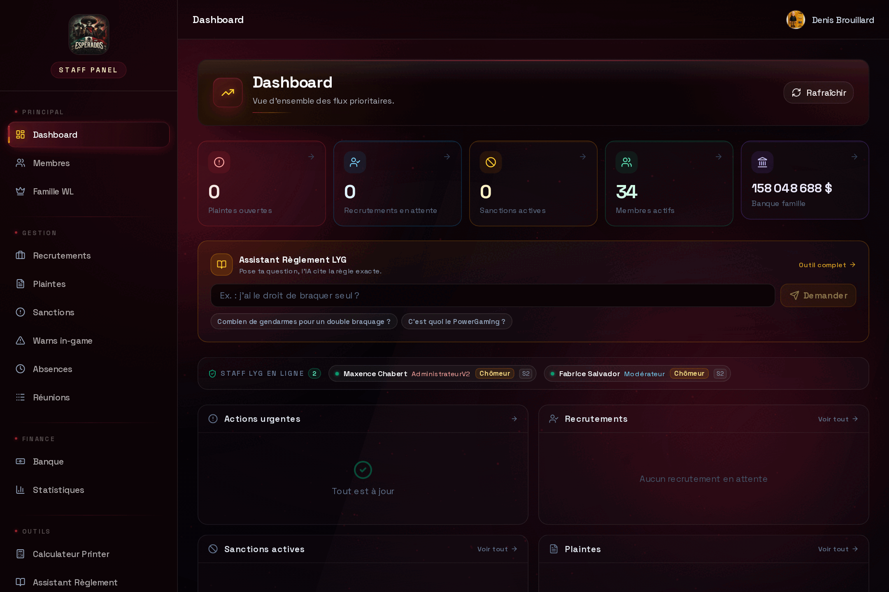<br/><sub><b>Dashboard staff</b> — KPI temps réel, assistant Règlement &amp; staff en ligne</sub></td>
    <td width="50%">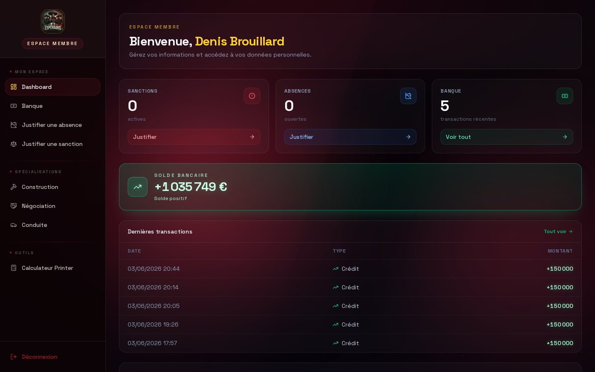<br/><sub><b>Espace membre</b> — solde, hiérarchie famille &amp; mini-chat règlement</sub></td>
  </tr>
  <tr>
    <td width="50%">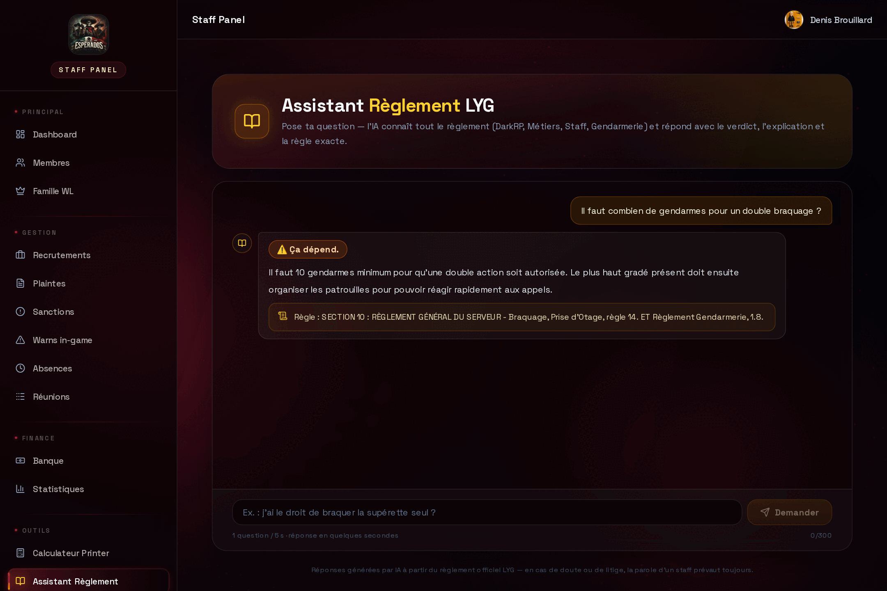<br/><sub><b>Assistant Règlement IA</b> — verdict + article exact (Gemini gratuit)</sub></td>
    <td width="50%">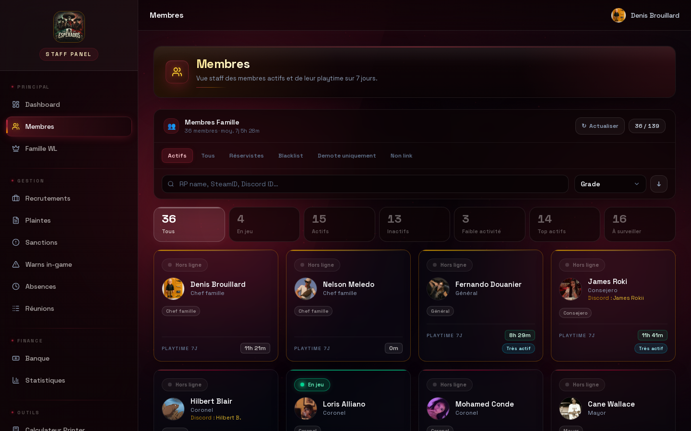<br/><sub><b>Membres</b> — filtres, statut « en jeu » live</sub></td>
  </tr>
  <tr>
    <td width="50%">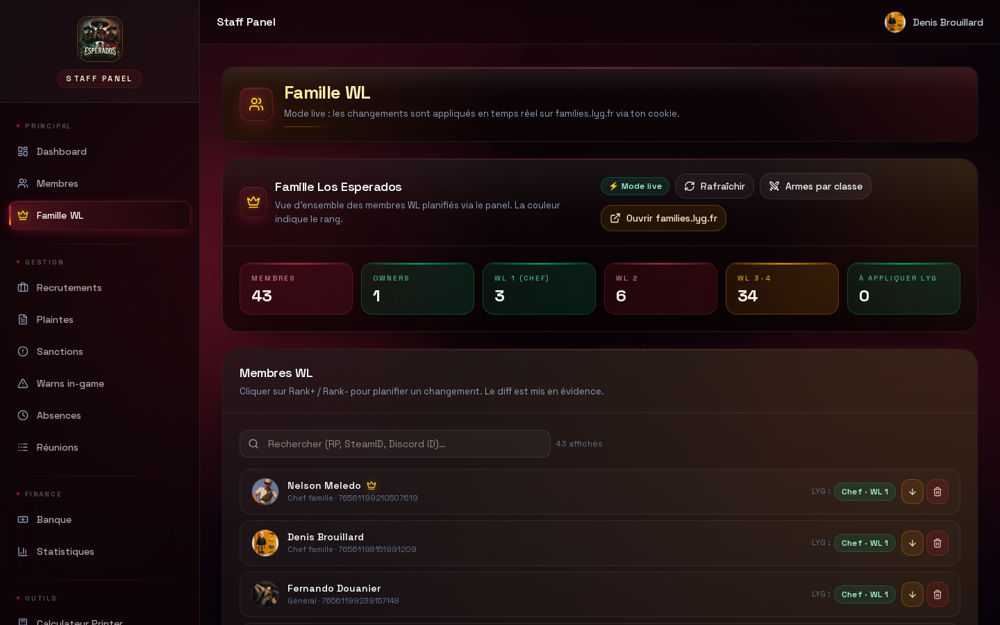<br/><sub><b>Whitelist famille</b> — gérée en live sur le site tiers</sub></td>
    <td width="50%">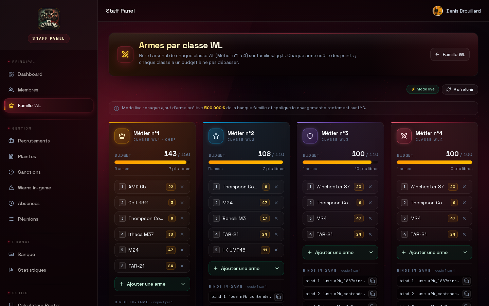<br/><sub><b>Armes par classe</b> — budget de points + binds</sub></td>
  </tr>
  <tr>
    <td width="50%">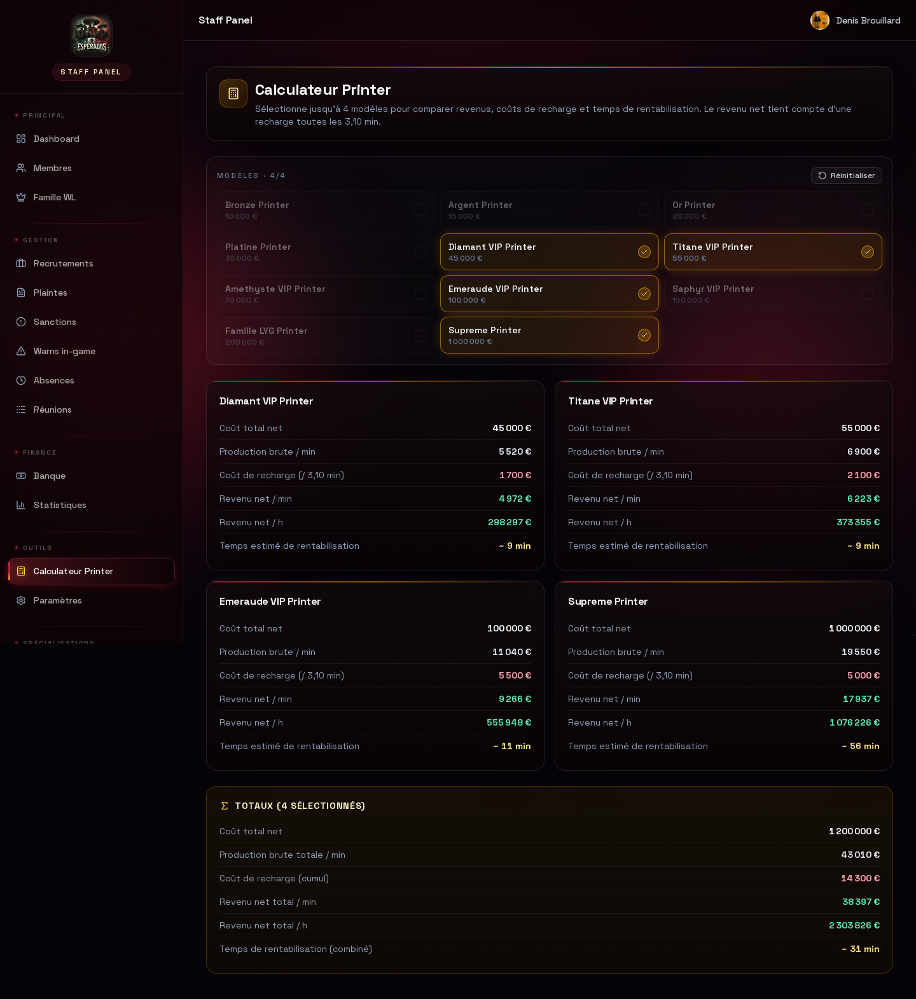<br/><sub><b>Calculateur</b> — comparateur de rentabilité (revenu net, rentabilisation)</sub></td>
    <td width="50%">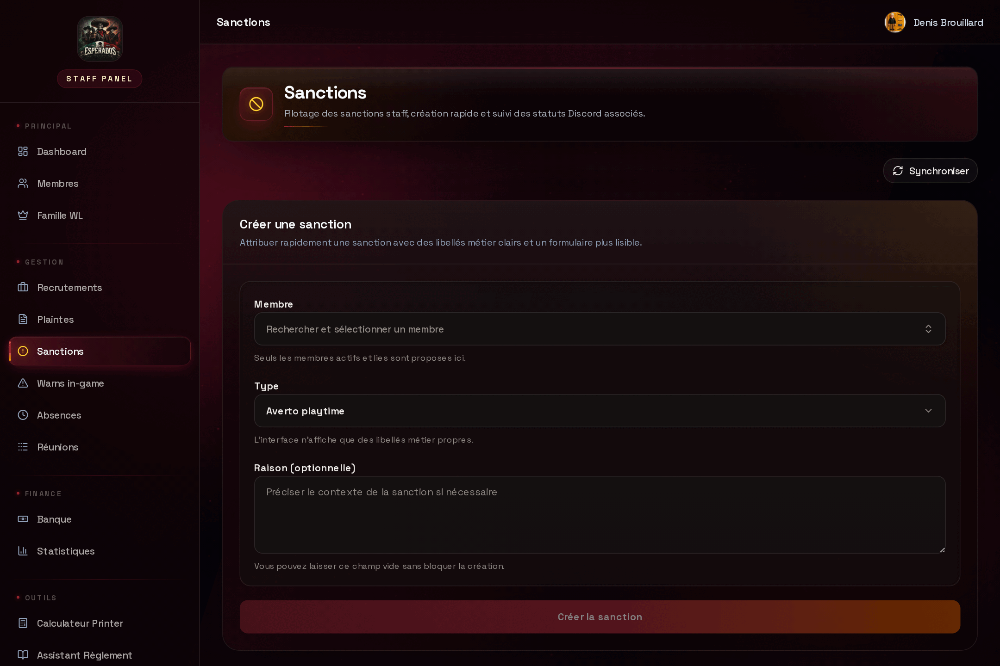<br/><sub><b>Sanctions</b> — création &amp; suivi (workflow + Discord)</sub></td>
  </tr>
  <tr>
    <td width="50%">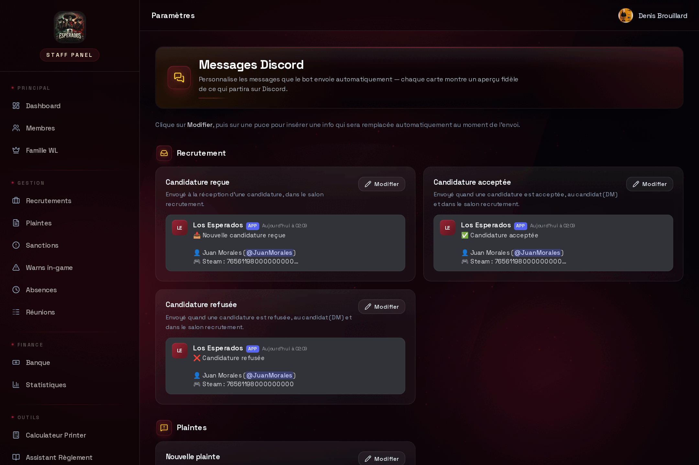<br/><sub><b>Pages Discord</b> — templates avec aperçu live &amp; pickers par nom</sub></td>
    <td width="50%" valign="middle"><sub>🤖 <b>Bot Discord</b> — logs enrichis, modération, anti-spam, commande <code>/reglement</code> par IA et message de hiérarchie auto-actualisé.<br/><em>(capture à ajouter depuis Discord — voir le <a href="docs/screenshots/CAPTURE_GUIDE.md">guide</a>)</em></sub></td>
  </tr>
</table>

---

## 📊 En chiffres

| | |
|---|---|
| **~109 000** lignes de TypeScript | **2** services en production (web + worker) |
| **242** routes API | **58** modèles de données (Prisma) |
| **79** pages | **19** migrations versionnées |
| **21** commandes Discord (dont `/reglement` IA) | **11** boucles de fond (sync, pollers, réconciliateurs) |
| **17** fichiers de tests (Vitest) | **12** notifications push automatiques |
| **239** commits — **1** développeur | **0 €** d'API externes (IA incluse) |

---

## 🏗️ Architecture

Deux processus Node indépendants qui communiquent via une **file de jobs en base** (pattern Outbox) — découplage, résilience et rejeu automatique.

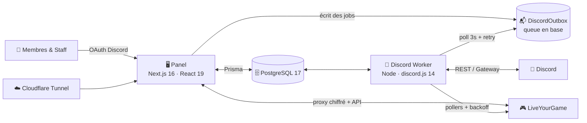

- **Panel** (`panel-esperados.service`) — l'application web Next.js (rendu serveur, API, auth).
- **Worker** (`discord-worker.service`) — le bot Discord + les pollers de synchronisation, en process séparé pour ne jamais bloquer le web.
- **Cloudflare Tunnel** — le site est exposé sans ouvrir un seul port sur internet.

---

## 🧩 Trois mécanismes clés, en images

### 📬 Le pattern Outbox — une action Discord ne se perd jamais

Le panel n'appelle **jamais** Discord directement : il écrit un job en base **dans la même transaction** que la donnée métier. Le worker le consomme avec retry — si Discord tombe, le job attend et sera rejoué.

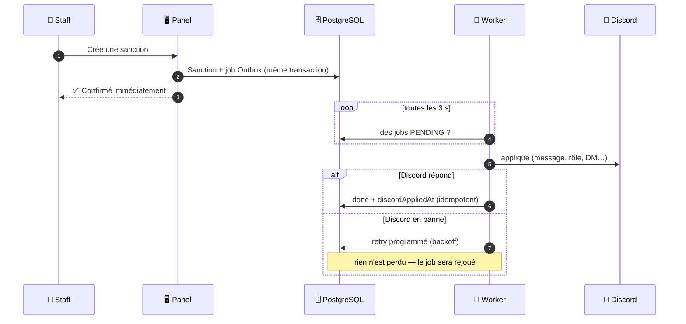

### 🔔 Notifications push — de l'événement jusqu'à la poche

**12 événements métier** notifient automatiquement le bon destinataire, sans app store, iPhone compris. Le worker n'a pas les clés de chiffrement : il délègue au panel via une route interne.

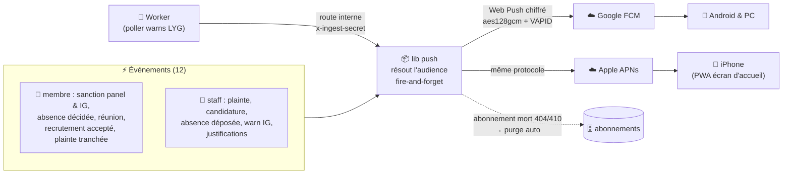

### 🤖 Assistant Règlement IA — un seul moteur, deux visages

Le même moteur répond sur **Discord** (`/reglement`) et sur **le site** (mini-chat des dashboards), avec un corpus toujours frais et une IA qui ne coûte rien.

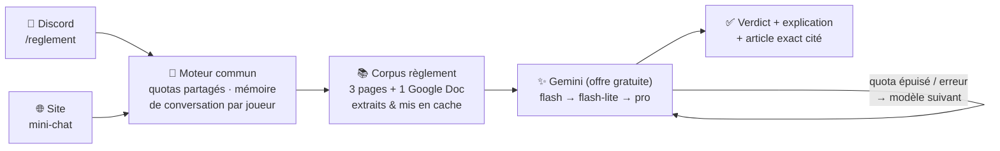

---

## ✨ Fonctionnalités clés

<table>
<tr><td valign="top" width="33%">

**🖥️ Panel staff**
- Membres (filtres, live in-game, fiches, **changement de grade**, seuil de playtime par membre)
- Sanctions (8 types, escalade, **rétrogradation**, sync rôles)
- Absences & réunions (workflows)
- Plaintes & **suggestions** : clôture **synchronisée Discord** (votes, fil de commentaires, thread archivé + DM/push)
- Recrutement + **classement quota recruteurs**
- **Rappels de dettes intelligents** (escalade + alerte État-Major, auto)
- Whitelists & armes in-game **en live**
- **Autorisations** : accès panel gérés en un clic
- Audit complet de chaque action

</td><td valign="top" width="33%">

**📱 Espace membre**
- Dashboard bancaire (solde visuel)
- **Hiérarchie famille** + **staff LYG en ligne** (live)
- Justifier une absence / sanction
- **Assistant Règlement IA** (mini-chat intégré)
- **App installable partout** : PWA (iPhone/Android) **+ appli Windows** (ferme en barre des tâches, notifs natives), diffusée via une page `/install` unique
- **12 notifications push** automatiques (sanctions panel & IG, absences, réunions, plaintes, recrutement, justifications) + doublure DM Discord
- **Playtime de la semaine** (objectif perso, masqué le week-end)
- **Courbes d'évolution** (argent & playtime, depuis l'entrée)
- Calculateur de rentabilité
- Guides publics (build, conduite…)

</td><td valign="top" width="33%">

**🤖 Bot Discord**
- **`/reglement`** : assistant de règles par IA
- Logs serveur enrichis (audit log)
- Modération (ban/kick/mute/warn)
- Anti-spam (flood, mentions, phishing)
- Auto-rôles & liaison de comptes
- Message de hiérarchie auto-mis à jour

</td></tr>
</table>

---

## 🔬 Points techniques notables

Les parties dont je suis le plus fier — celles qui montrent au-delà du CRUD :

- **🔁 Système distribué simple & résilient.** Toute action Discord (message, rôle, sanction) est écrite comme un **job en base**, consommé par le worker avec **retry, déduplication (`dedupeKey`) et idempotence (`discordAppliedAt`)**. Si Discord tombe, rien n'est perdu — les jobs sont rejoués.
- **🔒 Verrou mono-instance** sur le worker (heartbeat + TTL en base) : impossible de traiter deux fois le même job si deux instances démarrent par erreur.
- **🔐 Proxy chiffré vers un site tiers.** Le panel pilote en temps réel les whitelists in-game sur un site PHP externe via un **cookie de session chiffré AES-256-GCM** — keep-alive automatique, validation du budget de points **côté serveur**, et **réconciliation automatique** : les changements planifiés hors-ligne sont appliqués tout seuls dès que la session redevient valide.
- **🪞 Mirror Discord temps réel.** Les rôles et pseudos Discord sont répliqués en base **à l'événement** (gateway) + resync horaire de rattrapage : poser un rôle à la main sur Discord met à jour les accès du panel en ~1 s, et l'UI ne peut jamais diverger des guards serveur (même source de vérité).
- **🛡️ RBAC multi-tiers à levier central** (Chef / Sous-Chef / État-Major / Encadrant / Recruteur). Toutes les écritures **graves** (blacklist, démote, retrait famille, finalisation de réunion) passent par **un seul guard** (`isFullWriter`) — le durcissement se pilote donc en un point unique et auditable. L'**Encadrant** est positionné **proche de l'EM** (crée des avertissements, gère absences, réunions et recrutement) mais les actions « virer / blacklist » lui sont refusées **par type et par action** (403), y compris *à l'intérieur* d'une route mixte (ex. une décision de réunion démote/exclusion, ou la création d'une sanction bloquante). Guards par route serveur, **journalisation des accès refusés** (pas seulement des accès réussis), et **page d'administration des accès** (rôles appliqués sur Discord en un clic, audités).
- **🚫 Anti-contournement de sanction au rejoint.** Un membre blacklist / démote / réserviste qui quitte le Discord perd ses rôles ; à son **retour**, le bot re-pose **automatiquement** le rôle de sa sanction encore active (event `guildMemberAdd` → vérification de la sanction ACTIVE → réapplication + statut mis à jour + log). Impossible d'effacer une sanction en quittant puis revenant.
- **🕵️ Enrichissement par Audit Log Discord** : pour un ban/kick/mute, le bot remonte **qui** a fait l'action et **pourquoi** en croisant l'audit log de Discord.
- **🖼️ Avatars increvables** : un proxy unique (`/api/avatar/:id`) résout le hash Discord **en direct** (cache 1 h) et retombe sur l'avatar par défaut — l'image n'est jamais cassée, même quand un membre change sa photo. Une seule fonction route tous les écrans.
- **🪶 Mode léger** : une bascule (mémorisée par navigateur) coupe flous et animations pour les PC/GPU faibles, sans toucher à la mise en page — fluidité sur le matériel modeste.
- **📲 PWA + Web Push (VAPID) sans app store.** Le panel s'installe comme une appli (manifeste + service worker) et notifie en natif — y compris sur iPhone via l'écran d'accueil. **12 événements métier** déclenchent des push automatiques (voir le schéma plus haut), en *fire-and-forget* pour ne jamais bloquer un flux, avec **purge automatique des abonnements morts** (404/410) et audience staff résolue via le mirror des rôles Discord. Le worker (qui ne porte pas les clés) délègue ses événements — warns IG — au panel via une **route interne à secret partagé**. Chaîne validée de bout en bout (chiffrement `aes128gcm` vérifié par déchiffrement). Une **doublure DM Discord** double chaque notif membre : filet de sécurité quand le push n'arrive pas (PC fermé).
- **🖥️ Appli de bureau Windows (Electron), cross-buildée depuis Linux.** Wrapper qui **ferme dans la barre des tâches** (croix = masquer), se lance au démarrage et garde une instance unique. Comme le web push ne marche pas dans Electron (pas de clés FCM), un **pont maison** relaie les notifications : le panel les publie dans un bus mémoire, l'appli (repérée par son User-Agent) le sonde et affiche des toasts natifs. Installeur NSIS produit sous `wine`, distribué en un lien via `/install`.
- **🤖 Assistant Règlement par IA (RAG maison, 0 €).** Le corpus complet du règlement (3 pages web + 1 Google Doc) est extrait, nettoyé et mis en cache, puis injecté à un LLM **Gemini en offre gratuite**. Réponses structurées (verdict + explication + article cité), **mémoire de conversation** par joueur (les questions de suivi gardent le contexte), **bascule automatique entre modèles** quand un quota journalier est épuisé, et **quotas partagés Discord ↔ site** (un seul moteur derrière la commande `/reglement` et le mini-chat du site).
- **⏱️ Pollers conscients du quota.** ~57 requêtes / 15 min vers l'API tierce — **sous le budget de 100 req/15 min** — avec backoff automatique sur HTTP 429 et garde anti-chevauchement (`isRunning`).
- **♻️ Réconciliateurs de fond auto-correcteurs.** Plusieurs boucles idempotentes qui gardent le système cohérent sans intervention : **détection automatique des départs** (un membre absent du roster > 30 min est désactivé — la sync le réactive s'il revient) ; **rappels de dettes intelligents** (cooldown en jours ancré sur l'heure d'envoi, mémoire de qui rembourse, escalade + alerte État-Major au 3ᵉ rappel) ; **mise en whitelist WL3 automatique** des membres promus (écrite en direct sur le site tiers) ; et **réalignement des grades** du panel sur les rôles Discord réels (fini les grades périmés après une promotion faite à la main). Chacune n'agit que sur un écart réel et ne casse jamais un état légitime.
- **🧱 Pensé sécurité de bout en bout** : OAuth obligatoire, secrets *fail-closed*, PII (Discord↔Steam↔RP) réservée au staff, services internes bindés en `127.0.0.1`, secrets git-ignorés, surface de debug fermée en production. **Audité route par route** (l'intégralité des endpoints), avec vérification de la signature des interactions Discord et durcissement des tiers d'écriture.

---

## 🛠️ Stack technique

| Domaine | Technologies |
|---|---|
| **Frontend** | Next.js 16 (App Router), React 19, TypeScript, Tailwind CSS 4, Radix UI, Framer Motion |
| **Backend** | Next.js Route Handlers, Prisma 5 ORM |
| **Base de données** | PostgreSQL 17 |
| **Auth** | NextAuth.js v4 (OAuth Discord, PrismaAdapter, sessions en base) |
| **Bot** | Discord.js 14 (process worker dédié) |
| **Sécurité** | Chiffrement AES-256-GCM, RBAC, audit DB |
| **Tests** | Vitest |
| **Infra** | VPS Ubuntu, systemd, Cloudflare Tunnel, Sentry |

---

## 🚀 Démarrage rapide

```bash
# 1. Installer
git clone <repo> && cd panel
npm install && (cd discord-worker && npm install)

# 2. Configurer : créer .env.prod (DATABASE_URL, Discord OAuth, LYG, secrets…)
#    Liste complète des variables : docs/FEATURES.md + env/README-ENV.md

# 3. Base de données
npx prisma migrate deploy && npx prisma generate

# 4. Lancer (dev)
npm run dev
(cd discord-worker && npm run dev)
```

> ⚙️ Configuration complète (variables d'environnement, Discord Developer Portal, déploiement systemd) : **[docs/FEATURES.md](docs/FEATURES.md)**.

---

## 🎓 Ce que ce projet démontre

- **Full-stack de bout en bout** : modélisation de données → API → UI → déploiement et exploitation en prod.
- **Conception de système distribué** : deux services découplés, communication asynchrone par file de jobs, idempotence.
- **Intégrations tierces robustes** : API Discord (REST + Gateway) et automatisation d'un site externe via session chiffrée.
- **Sécurité applicative** : authentification, autorisation fine, chiffrement de secrets, audit.
- **Capacité à livrer ET maintenir** : observabilité (Sentry), migrations versionnées, durcissement progressif, services systemd.
- **Autonomie complète** : seul aux commandes, du cahier des charges au support en production.

---

## 🧭 Limites assumées & pistes d'évolution

*(Parce qu'un bon projet sait aussi où il peut grandir.)*

- **Couverture de tests à étendre** — la base existe (Vitest), à prioriser sur les libs critiques (proxy LYG, RBAC, outbox).
- **Mono-locataire** — couplé à une communauté/serveur ; une refonte multi-tenant le rendrait réutilisable.
- **CI/CD** — déploiement actuellement manuel (build + `systemctl restart`) ; un pipeline GitHub Actions serait la suite logique.
- **Documentation d'API** — formaliser un contrat (OpenAPI) pour les routes internes.

---

## 👤 Auteur

Conçu, développé et maintenu en solo par **Syko** pour la communauté **Los Esperados** (Garry's Mod RP FR — serveur LiveYourGame).

<div align="center"><sub>Projet personnel · code propriétaire — présenté ici à des fins de portfolio.</sub></div>
